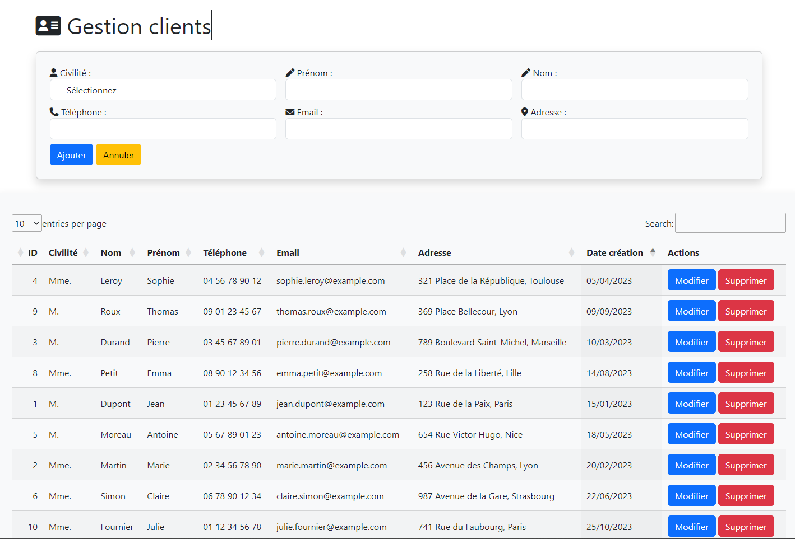
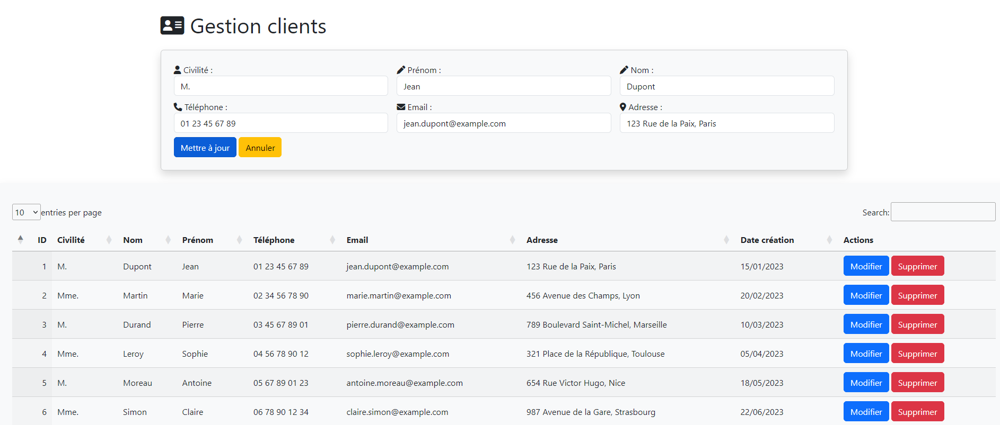

## Fonctionnalités
- Ajout et modification des clients via un formulaire stylé avec Bootstrap.
- Affichage des entrées dans un tableau interactif avec tri, recherche et pagination via DataTables.
- Suppression avec fenêtre de confirmation.

## Technologies utilisées
- **PHP 8.2** : Langage de programmation.
- **MySQL / MariaDB** : Systèmes de base de données.
- **Bootstrap 5.3.3** : Framework CSS pour le design responsive.
- **jQuery 3.7.1** : Bibliothèque JavaScript pour DataTables et interactions.
- **DataTables 2.3.4** : Bibliothèque pour les tableaux interactifs.
- **Font Awesome 6.5.1** : Icônes pour les boutons d'action.

## Ajout client : 

## Modification client : 

